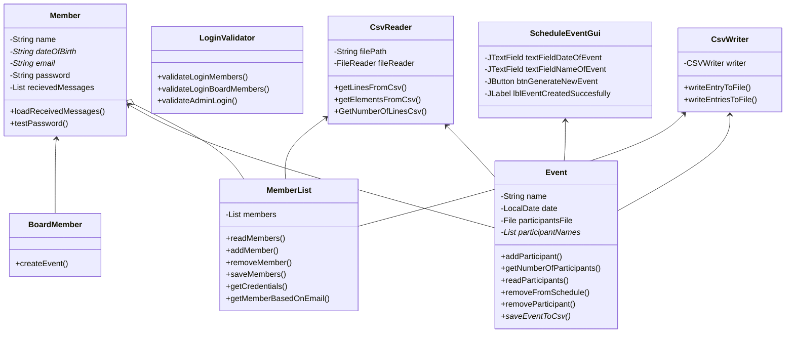

```mermaid
classDiagram
    class Member{
        -String name
        -String dateOfBirth*
        -String email*
        -String password
        -List<String> recievedMessages

        +loadReceivedMessages()
        +testPassword()
    }
    class BoardMember{
        +createEvent()
    }
    class MemberList{
        -List<Member> members
        
        +readMembers()
        +addMember()
        +removeMember()
        +saveMembers()
        +getCredentials()
        +getMemberBasedOnEmail()
    }
    class Event{
        -String name
        -LocalDate date
        -File participantsFile
        -List<String> participantNames*

        +addParticipant()
        +getNumberOfParticipants()
        +readParticipants()
        +removeFromSchedule()
        +removeParticipant()
        +saveEventToCsv()*
    }

    class LoginValidator{
        +validateLoginMembers()
        +validateLoginBoardMembers()
        +validateAdminLogin()
    }

    class CsvWriter{
        -CSVWriter writer
        +writeEntryToFile()
        +writeEntriesToFile()
    }

    class CsvReader {
        -String filePath
        -FileReader fileReader

        +getLinesFromCsv()
        +getElementsFromCsv()
        +GetNumberOfLinesCsv()
    }
    class ScheduleEventGui{
        -JTextField textFieldDateOfEvent
        -JTextField textFieldNameOfEvent
        -JButton btnGenerateNewEvent
        -JLabel lblEventCreatedSuccesfully
    }

    Member <-- BoardMember
    Member <-- Event
    Member o-- MemberList

    CsvReader <-- MemberList
    CsvWriter <-- MemberList
    CsvReader <-- Event
    CsvWriter <-- Event

    ScheduleEventGui <-- Event

```
