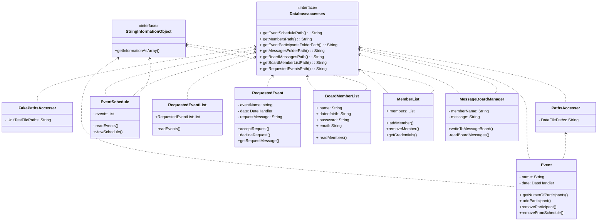

```mermaid
classDiagram
  Databaseaccesses <..	FakePathsAccesser
  Databaseaccesses <..	PathsAccesser
  Databaseaccesses <.. EventSchedule
  Databaseaccesses <.. RequestedEventList
  Databaseaccesses <.. RequestedEvent
  Databaseaccesses <.. BoardMemberList
  Databaseaccesses <.. MemberList
  Databaseaccesses <.. EventSchedule
  Databaseaccesses <.. MessageBoardManager
  Databaseaccesses <.. MessageBoardManager
  StringInformationObject <.. MemberList
  StringInformationObject <.. Event
  StringInformationObject <.. BoardMemberList
  StringInformationObject <.. EventSchedule
  Databaseaccesses <.. Event
  PathsAccesser <.. Event

    class Databaseaccesses{
      <<interface>>
      	+ getEventSchedulePath(): String
	+ getMembersPath(): String
	+ getEventParticipantsFolderPath(): String
	+ getMessagesFolderPath(): String
	+ getBoardMessagesPath(): String
	+ getBoardMemberListPath(): String
	+ getRequestedEventsPath(): String
}
    class FakePathsAccesser{
      - UnitTestFilePaths: String
    }
    class PathsAccesser{
      - DataFilePaths: String
        }

    class StringInformationObject{
      <<interface>>
      +getInformationAsArray()
    }

    class Event{
      - name: String
      - date: DateHandler
      + getNumerOfParticipants()
      + addParticipant()
      +removeParticipant()
      +removeFromSchedule()
    }

    class EventSchedule{
      - events: list<Event>
      - readEvents()
      +viewSchedule()
    }

    class RequestedEventList{
      +RequestedEventList: list
      - readEvents()
    }

    class RequestedEvent{
      - eventName: string
      - date: DateHandler
      - requestMessage: String
      +acceptRequest()
      +declineRequest()
      +getRequestMessage()
    }

    class BoardMemberList{
      + name: String
      + dateofbirth: String
      + password: String
      + email: String
      + readMembers()
    }

    class MemberList{
      + members: List
      + addMember()
      +removeMember()
      +getCredentials()
    }

    class MessageBoardManager{
      - memberName: String
      - message: String
      +writeToMessageBoard()
      -readBoardMessages()
    }
    
```
