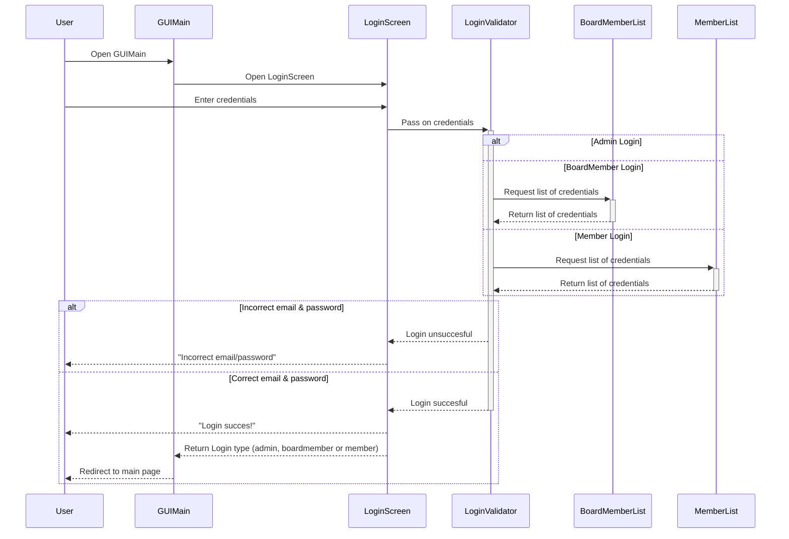

```mermaid
sequenceDiagram 
    User ->>  GUIMain: Open GUIMain
    GUIMain ->>  LoginScreen: Open LoginScreen
    User->>LoginScreen: Enter credentials
    LoginScreen ->>+ LoginValidator: Pass on credentials

    alt Admin Login
    else BoardMember Login
    LoginValidator ->>+ BoardMemberList: Request list of credentials
    BoardMemberList -->>- LoginValidator: Return list of credentials
    else Member Login
    LoginValidator ->>+ MemberList: Request list of credentials
    MemberList -->>- LoginValidator: Return list of credentials
    end

    alt Incorrect email & password
    LoginValidator -->> LoginScreen: Login unsuccesful 
    LoginScreen -->> User: "Incorrect email/password" 
    else Correct email & password
    LoginValidator -->>- LoginScreen: Login succesful
    LoginScreen -->> User: "Login succes!"
    LoginScreen -->> GUIMain: Return Login type (admin, boardmember or member)
    GUIMain -->>User: Redirect to main page
    end
```

