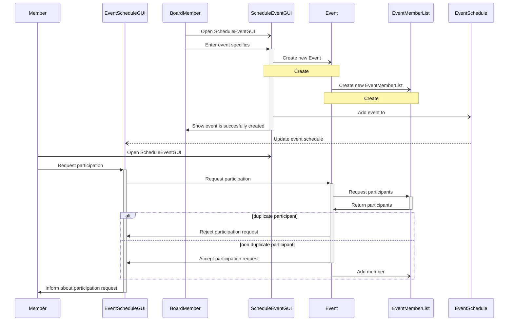

```mermaid
sequenceDiagram
    participant Member 
    participant EventScheduleGUI
    BoardMember -)  ScheduleEventGUI: Open ScheduleEventGUI
    BoardMember ->>+  ScheduleEventGUI: Enter event specifics   
    ScheduleEventGUI -) Event: Create new Event
    Note over ScheduleEventGUI,Event: Create

    Event -) EventMemberList: Create new EventMemberList
    Note over Event,EventMemberList: Create
    ScheduleEventGUI -) EventSchedule: Add event to
    ScheduleEventGUI ->>- BoardMember: Show event is succesfully created


    EventSchedule --) EventScheduleGUI: Update event schedule
    
   
    Member  -)  ScheduleEventGUI: Open ScheduleEventGUI
    Member ->>+ EventScheduleGUI: Request participation
    EventScheduleGUI ->>+ Event: Request participation
    Event->>+ EventMemberList: Request participants
    EventMemberList->>- Event: Return participants

    alt duplicate participant
    Event ->> EventScheduleGUI: Reject participation request 
    else non duplicate participant
    Event ->>- EventScheduleGUI: Accept participation request
    Event -) EventMemberList: Add member
    end
    EventScheduleGUI ->>- Member: Inform about participation request
    
```
